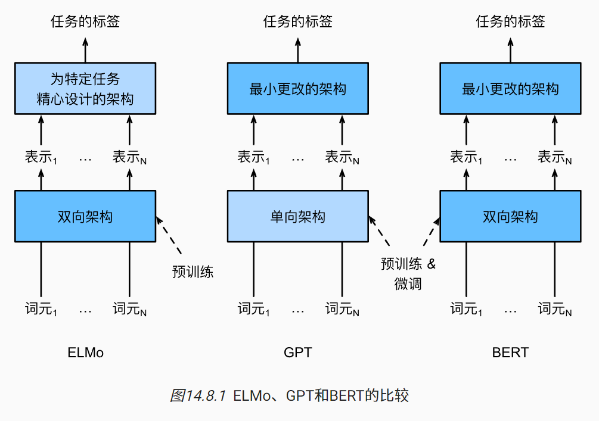
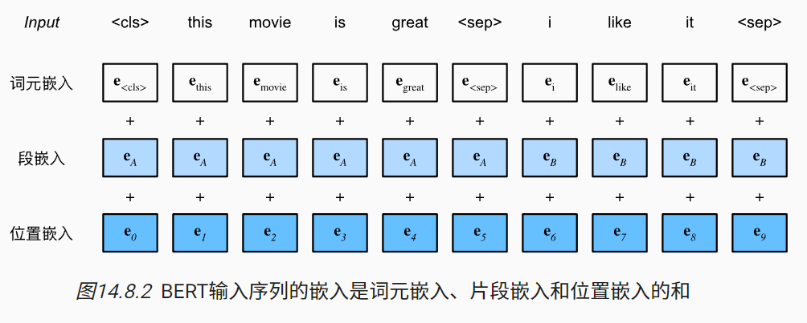

# 14. 自然语言处理：预训练

14.1. 词嵌入（Word2vec）
14.1.1. 为何独热向量是一个糟糕的选择
14.1.2. 自监督的word2vec
14.1.3. 跳元模型（Skip-Gram）
14.1.4. 连续词袋（CBOW）模型
14.1.5. 小结
14.1.6. 练习
14.2. 近似训练
14.2.1. 负采样
14.2.2. 层序Softmax
14.2.3. 小结
14.2.4. 练习
14.3. 用于预训练词嵌入的数据集
14.3.1. 正在读取数据集
14.3.2. 下采样
14.3.3. 中心词和上下文词的提取
14.3.4. 负采样
14.3.5. 小批量加载训练实例
14.3.6. 整合代码
14.3.7. 小结
14.3.8. 练习
14.4. 预训练word2vec
14.4.1. 跳元模型
14.4.2. 训练
14.4.3. 应用词嵌入
14.4.4. 小结
14.4.5. 练习
14.5. 全局向量的词嵌入（GloVe）
14.5.1. 带全局语料统计的跳元模型
14.5.2. GloVe模型
14.5.3. 从条件概率比值理解GloVe模型
14.5.4. 小结
14.5.5. 练习
14.6. 子词嵌入
14.6.1. fastText模型
14.6.2. 字节对编码（Byte Pair Encoding）
14.6.3. 小结
14.6.4. 练习
14.7. 词的相似性和类比任务
14.7.1. 加载预训练词向量
14.7.2. 应用预训练词向量
14.7.3. 小结
14.7.4. 练习
14.8. 来自Transformers的双向编码器表示（BERT）
14.8.1. 从上下文无关到上下文敏感
14.8.2. 从特定于任务到不可知任务

尽管ELMo显著改进了各种自然语言处理任务的解决方案，但每个解决方案仍然依赖于一个特定于任务的架构。然而，为每一个自然语言处理任务设计一个特定的架构实际上并不是一件容易的事。

> GPT（Generative Pre Training，生成式预训练）模型为上下文的敏感表示设计了通用的任务无关模型 [Radford et al., 2018]

GPT建立在Transformer解码器的基础上，预训练了一个用于表示文本序列的语言模型。当将GPT应用于下游任务时，语言模型的输出将被送到一个附加的线性输出层，以预测任务的标签。与ELMo冻结预训练模型的参数不同，GPT在下游任务的监督学习过程中对预训练Transformer解码器中的所有参数进行微调。GPT在自然语言推断、问答、句子相似性和分类等12项任务上进行了评估，并在对模型架构进行最小更改的情况下改善了其中9项任务的最新水平。

14.8.3. BERT：把两个最好的结合起来




14.8.4. 输入表示



```py
#@save
class BERTEncoder(nn.Module):
    """BERT编码器"""
    def __init__(self, vocab_size, num_hiddens, norm_shape, ffn_num_input,
                 ffn_num_hiddens, num_heads, num_layers, dropout,
                 max_len=1000, key_size=768, query_size=768, value_size=768,
                 **kwargs):
        super(BERTEncoder, self).__init__(**kwargs)
        self.token_embedding = nn.Embedding(vocab_size, num_hiddens)
        self.segment_embedding = nn.Embedding(2, num_hiddens)
        self.blks = nn.Sequential()
        for i in range(num_layers):
            self.blks.add_module(f"{i}", d2l.EncoderBlock(
                key_size, query_size, value_size, num_hiddens, norm_shape,
                ffn_num_input, ffn_num_hiddens, num_heads, dropout, True))
        # 在BERT中，位置嵌入是可学习的，因此我们创建一个足够长的位置嵌入参数
        self.pos_embedding = nn.Parameter(torch.randn(1, max_len,
                                                      num_hiddens))

    def forward(self, tokens, segments, valid_lens):
        # 在以下代码段中，X的形状保持不变：（批量大小，最大序列长度，num_hiddens）
        X = self.token_embedding(tokens) + self.segment_embedding(segments)
        X = X + self.pos_embedding.data[:, :X.shape[1], :]
        for blk in self.blks:
            X = blk(X, valid_lens)
        return X
```

14.8.5. 预训练任务

14.8.5.1. 掩蔽语言模型（Masked Language Modeling）(克漏字)

如 8.3节所示，语言模型使用左侧的上下文预测词元。为了双向编码上下文以表示每个词元，BERT随机掩蔽词元并使用来自双向上下文的词元以自监督的方式预测掩蔽词元。此任务称为掩蔽语言模型。

在这个预训练任务中，将随机选择15%的词元作为预测的掩蔽词元。要预测一个掩蔽词元而不使用标签作弊，一个简单的方法是总是用一个特殊的“<mask>”替换输入序列中的词元。然而，人造特殊词元“<mask>”不会出现在微调中。为了避免预训练和微调之间的这种不匹配，如果为预测而屏蔽词元（例如，在“this movie is great”中选择掩蔽和预测“great”），则在输入中将其替换为：

80%时间为特殊的“<mask>“词元（例如，“this movie is great”变为“this movie is<mask>”；

10%时间为随机词元（例如，“this movie is great”变为“this movie is drink”）；

10%时间内为不变的标签词元（例如，“this movie is great”变为“this movie is great”）。

请注意，在15%的时间中，有10%的时间插入了随机词元。这种偶然的噪声鼓励BERT在其双向上下文编码中不那么偏向于掩蔽词元（尤其是当标签词元保持不变时）。

14.8.5.2. 下一句预测（Next Sentence Prediction）

尽管掩蔽语言建模能够编码双向上下文来表示单词，但它不能显式地建模文本对之间的逻辑关系。为了帮助理解两个文本序列之间的关系，BERT在预训练中考虑了一个二元分类任务——下一句预测。在为预训练生成句子对时，有一半的时间它们确实是标签为“真”的连续句子；在另一半的时间里，第二个句子是从语料库中随机抽取的，标记为“假”。

下面的NextSentencePred类使用单隐藏层的多层感知机来预测第二个句子是否是BERT输入序列中第一个句子的下一个句子。由于Transformer编码器中的自注意力，特殊词元“<cls>”的BERT表示已经对输入的两个句子进行了编码。因此，多层感知机分类器的输出层（self.output）以X作为输入，其中X是多层感知机隐藏层的输出，而MLP隐藏层的输入是编码后的“<cls>”词元。


```py
class BERTModel(nn.Module):
    """BERT模型"""
    def __init__(self, vocab_size, num_hiddens, norm_shape, ffn_num_input,
                 ffn_num_hiddens, num_heads, num_layers, dropout,
                 max_len=1000, key_size=768, query_size=768, value_size=768,
                 hid_in_features=768, mlm_in_features=768,
                 nsp_in_features=768):
        super(BERTModel, self).__init__()
        self.encoder = BERTEncoder(vocab_size, num_hiddens, norm_shape,
                    ffn_num_input, ffn_num_hiddens, num_heads, num_layers,
                    dropout, max_len=max_len, key_size=key_size,
                    query_size=query_size, value_size=value_size)
        self.hidden = nn.Sequential(nn.Linear(hid_in_features, num_hiddens),
                                    nn.Tanh())
        self.mlm = MaskLM(vocab_size, num_hiddens, mlm_in_features)
        self.nsp = NextSentencePred(nsp_in_features)

    def forward(self, tokens, segments, valid_lens=None,
                pred_positions=None):
        encoded_X = self.encoder(tokens, segments, valid_lens)
        if pred_positions is not None:
            mlm_Y_hat = self.mlm(encoded_X, pred_positions)
        else:
            mlm_Y_hat = None
        # 用于下一句预测的多层感知机分类器的隐藏层，0是“<cls>”标记的索引
        nsp_Y_hat = self.nsp(self.hidden(encoded_X[:, 0, :]))
        return encoded_X, mlm_Y_hat, nsp_Y_hat
```

14.9. 用于预训练BERT的数据集


