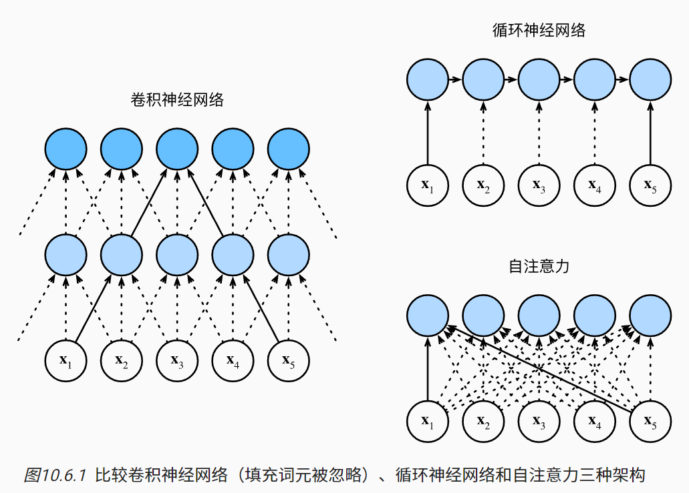

# 深度學習

對於各種不同的深度學習神經網路模型，其實我都很難理解到底為何那個模型長這樣，就可以表現得很好？

## 用投票法理解深度學習

我只能用《直覺投票法》來解釋這一切了：

1. 全連接 (Fully Connected) ：這一層的每個人都可以對下一層的所有人投票。
2. 卷積 (CNN) : 鄰居們要揪團才能投票，例如九宮格連坐投票法。
3. 循環 (RNN) : 每個人都可以對自己這層的每個人投票，也可以投自己一票。
4. 生成對抗網路 (GAN) : 我投票後老師打分數，看我投得好不好，然後我再修正該怎麼投票才能投得高分。
5. 注意力 Transformer : 我投的票會和我對該物體的注意程度有關，注意程度愈高，就可以投愈多票。
6. ReLU : 低於某個門檻以下的投票通通都是廢票，無效！
7. Sigmoid : 投的票數最後會正規化到 0-1 之間，最多 1 分，最少 0 分。
8. AveragePool : 你投的票會和鄰居的一起算平均，最後只有平均票會出去。
9. MaxPool : 你投的票會和鄰居的一起算，最大的那一票會出去。

## 用數位邏輯理解深度學習

1. 非循環神經網路： 組合邏輯 f(x)
2. 循環神經網路： 循序邏輯 s[t+1] = f(x, s[t])

為何加上非線性層，像是 Sigmoid 或 ReLU

否則就會退化成矩陣相乘，那能力就是線性的，只要用一個矩陣就能表示了。

1. sigmoid(w1 x + w2 y - b) 或 ReLU(w1 x + w2 y - b) 可以模仿 and, or 。
2. 所以多層的上述元件就可以做出 xor  (ab' + a'b)。
3. 因此任何邏輯電路都可以用多層神經網路兜出來。

